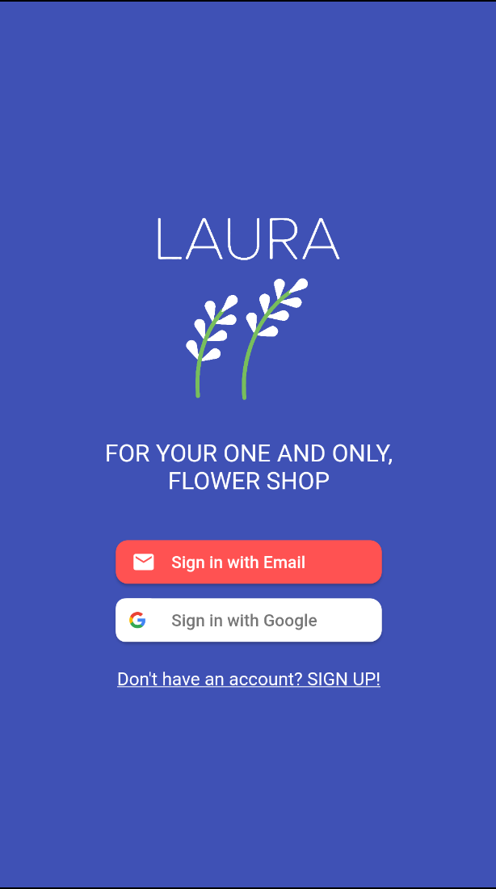
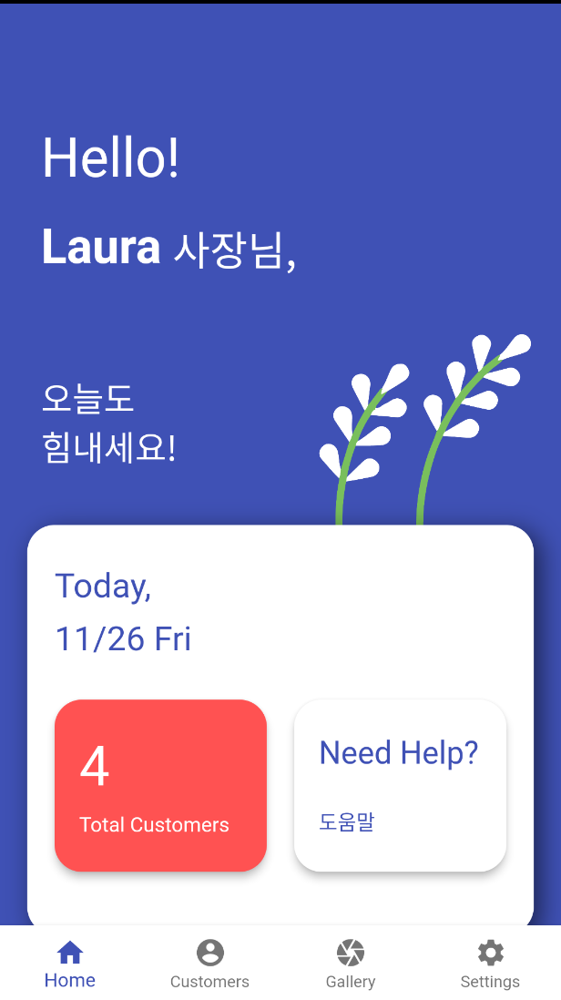
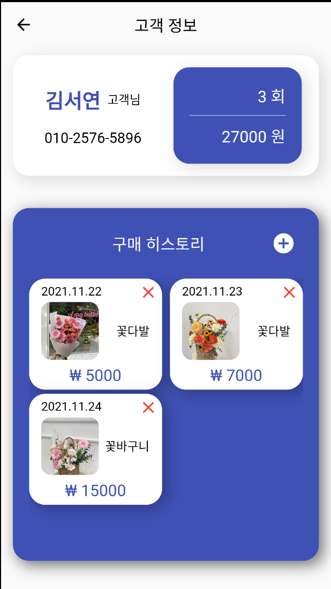
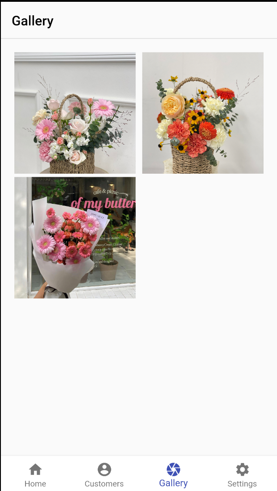
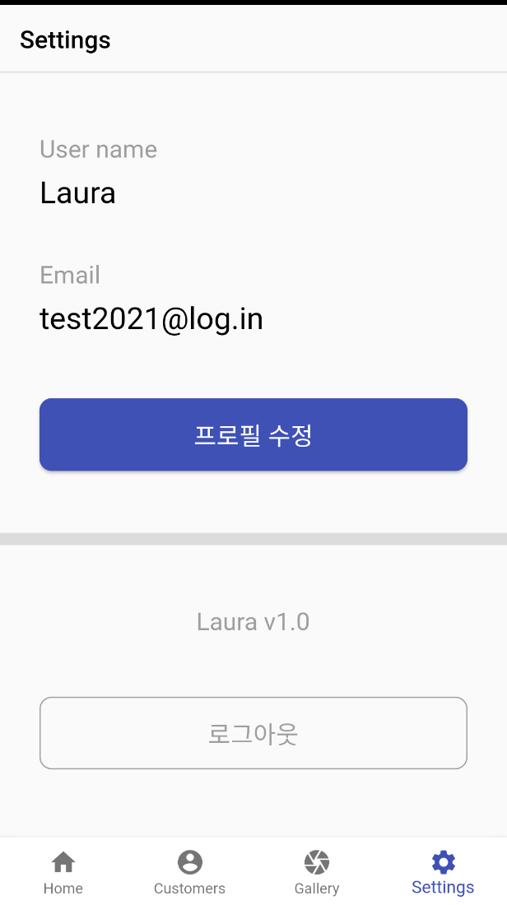

# "Laura", for florists(en)
It is a prototype flutter app for "Laura"  for people in the floristry field. You can manage your customers, keep track of each customer's history.

# Stacks
- Flutter/Dart
- Firebase

This project uses Flutter's [Provider](https://pub.dev/packages/provider) approach for managing an app state.

# Preview
### Screenshots:

### Initial page
- App users can either log in with their email or through google authentication. The authentication feature is supported through the Firebase Authentication feature.

### Home page
- People can view the number of total customers and help guide. More options will be added in future releases.

### Customer management page
- Users can add customers, add customers' history and view them in order. Users can add photos taken for each purchase to keep track of customers' preferences.

### Gallery page
- For florists, it is important to view their creations. For those who want to see all their products on one page, this service offers an extra tab to view all those photos taken for each customer.

### Settings
- This is where users can edit their information and log out.

# Google play download
https://play.google.com/store/apps/details?id=com.laura.flower

# ETC
- [꽃집 사장님들을 위한 Laura 서비스 개발 마무리(ko)](https://medium.com/@hayoung0.lee/%EA%BD%83%EC%A7%91-%EC%82%AC%EC%9E%A5%EB%8B%98%EB%93%A4%EC%9D%84-%EC%9C%84%ED%95%9C-laura-%EC%84%9C%EB%B9%84%EC%8A%A4-%EA%B0%9C%EB%B0%9C-%EB%A7%88%EB%AC%B4%EB%A6%AC-7712ceea59aa)

 

# About the application(ko)

전국의 꽃집 사장님들의 단 하나뿐인 화훼산업 고객관리 플랫폼, LAURA

너무나도 바쁜 꽃집 운영, 고객 관리는 “로라”가 대신해드릴게요!
전국 꽃집 사장님들을 위한 애플리케이션, 로라는 “전국 꽃집 사장님들의 단 하나뿐인 고객 관리 플랫폼”입니다. 로라 앱을 통해 다양한 꽃집 맞춤 고객 관리 서비스를 만나보세요.

► 일별 고객 방문 / 판매 수 집계
- 일별 방문자 수, 판매 금액을 한눈에 볼 수 있습니다. 매일매일 방문하는 잠재 단골 고객님들을 관리하여, 우리 숍 단골 고객님들을 만들어보세요.

► 고객별 구매 히스토리 관리
- 고객별 구매해가신 상품을 누적 관리할 수 있습니다. 간단한 사진, 메모를 통해 재방문 시 고객별 취향을 완벽 파악하여 단골 고객님의 재방문율을 높여보세요.

► 우리 플라워샵만의 포트폴리오 관리
- 우리 가게에서 판매한 상품 사진을 한눈에 볼 수 있습니다. 크기나 색감을 고르기 어려워하시는 고객님께, 우리 숍만의 포트폴리오를 보여드려 고객 만족도를 높여보세요.

